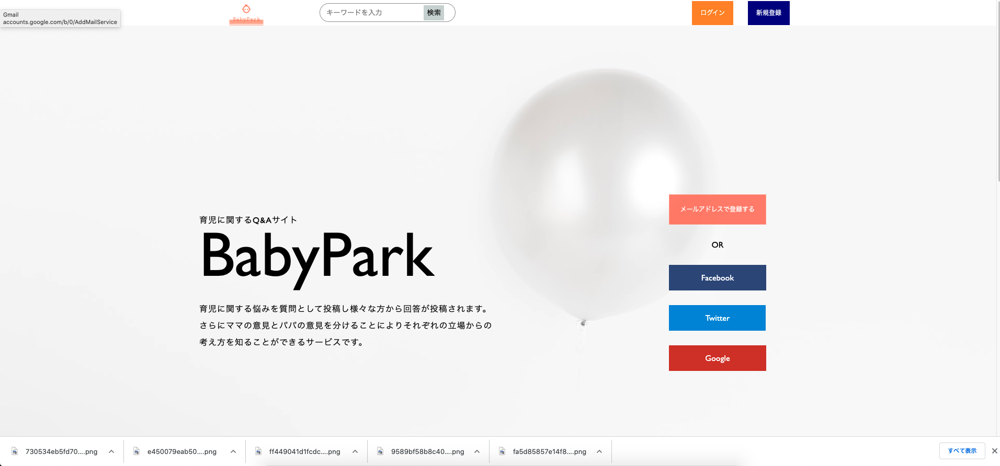
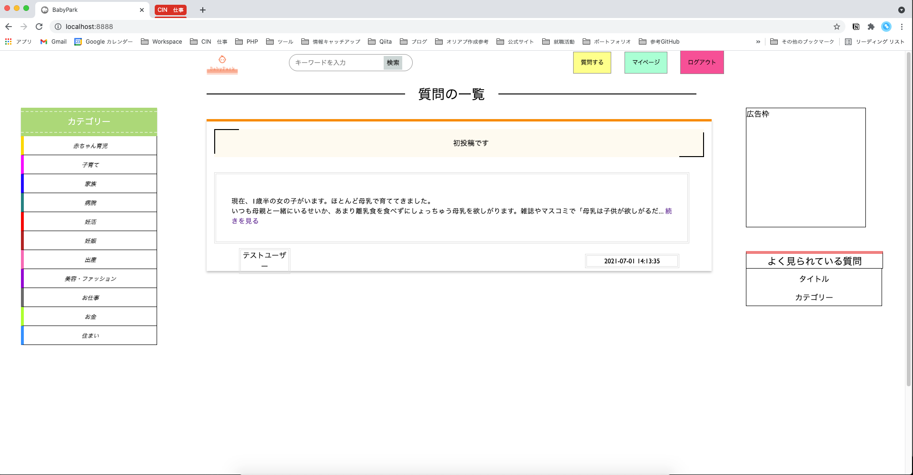

# BabyPark

## 概要
パパやママの育児の悩みを共有・解決するQ&Aアプリです。
アプリの特徴としては悩みなどを投稿し、コメントで解決策を提示します。

## 使い方
**MAMPのhtdocsにBabyParkのフォルダごと入れてローカルホストでアクセスしてください。**
会員登録を行いログインすることによって投稿機能や編集機能などが使えるようになっています。

ログインしたら質問を投稿、または投稿されている質問にコメントで解答をしましょう。
## 環境
MAMP/MySQL/PHP
## データベース
データベース名：babypark

テーブル
お使いのphpMyAdminに上のデータベースを作り、入っているphp_babypark.sqlをインポートしていただければお使い頂けるようになると思います。